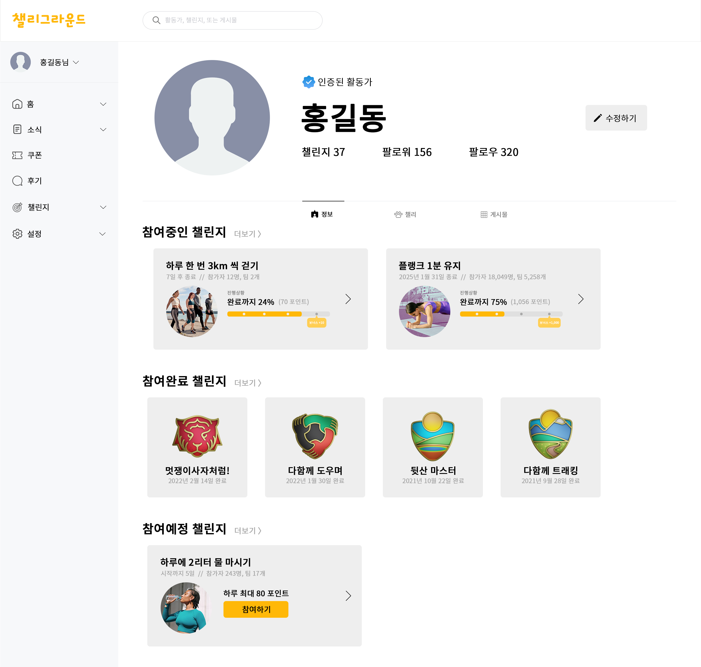
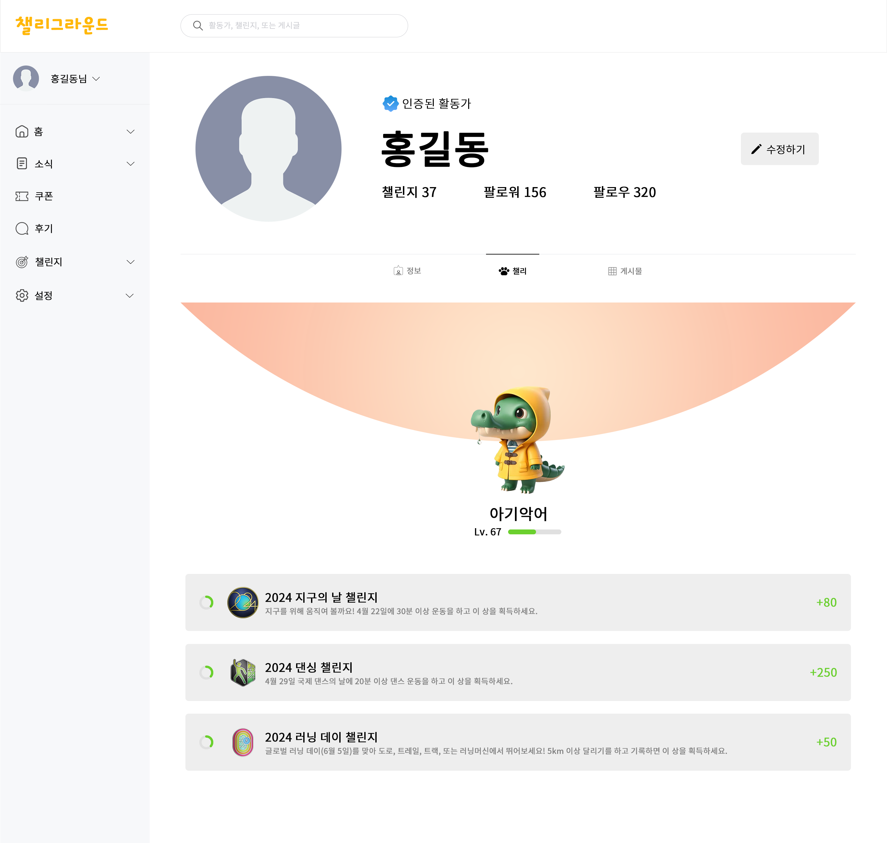

<h1 align="center">Challenge Everyday!</h1> 

  

  <i>멋쟁이사자처럼 대학 12기 해커톤 출품작</i> 
  Challey Ground (챌리그라운드) 는 <b>"갓생, 미라클모닝"</b>을 실천하고자 하는 현대인들에게 매일매일 다양한 챌린지에 참여해 더 나은 삶을 살 수 있도록 돕고, 서로를 연결해주는 플랫폼입니다. 다양한 프로젝트와 활동을 통해 삶의 질을 향상시키고, 새로운 도전과 배움을 통해 성장할 수 있는 공간입니다. 
  또한 사용자들이 식단을 공유해 개인의 건강을 너머 사회의 건강을 가꿔나가는 것을 목표로 하고 있습니다.

# Prototypes

  
  
  

# ❗안내
이 레포지토리는 프로토타입만 제공합니다.  
실제로 서비스되는 플랫폼이 아닙니다.  
`Copyright ⓒ 2024. Dongmin Lee. All rights reserved.`